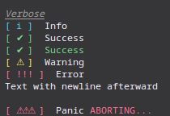

# `common.sh`

```bash,editable
_log
# feature rich logs with color support
# $1           : log text
# $2 (optional): v, i, ok, OK, warn, err, panic
# $3 (optional): nl 
# Example:

_log "Verbose" v
_log "Info" i
_log "Success" ok
_log "Success" OK
_log "Warning" warn
_log "Error" err
_log "Text with newline afterward" any-other-text nl
_log "Panic" panic

```

Output: 